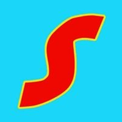

<!--
*** Thanks for checking out this README Template. If you have a suggestion that would
*** make this better, please fork the repo and create a pull request or simply open
*** an issue with the tag "enhancement".
*** Thanks again! Now go create something AMAZING! :D
-->

<!-- PROJECT SHIELDS -->
<!--
*** I'm using markdown "reference style" links for readability.
*** Reference links are enclosed in brackets [ ] instead of parentheses ( ).
*** See the bottom of this document for the declaration of the reference variables
*** for contributors-url, forks-url, etc. This is an optional, concise syntax you may use.
*** https://www.markdownguide.org/basic-syntax/#reference-style-links
-->

[![Issues][issues-shield]][issues-url]
[![MIT License][license-shield]][license-url]
[![LinkedIn][linkedin-shield]][linkedin-url]

<!-- PROJECT LOGO -->
 

  
  

  <h3 align="center">Samehadaku App</h3>

  

    Samehadaku Mobile App built with Flutter
     
    <a href="https://drive.google.com/drive/folders/17AyIAgCLLaB2QbhB3WD6F6nUcZJSDmHU?usp=sharing"><strong>Try the app »</strong></a>
     
     
    <a href="https://drive.google.com/drive/folders/17AyIAgCLLaB2QbhB3WD6F6nUcZJSDmHU?usp=sharing">View Demo</a>
    ·
    <a href="https://github.com/rizalord/samehadaku-app/issues">Report Bug</a>
    ·
    <a href="https://github.com/rizalord/samehadaku-app/issues">Request Feature</a>
  

<!-- TABLE OF CONTENTS -->
## Table of Contents

* [About the Project](#about-the-project)
* [Preview](#preview)
* [Getting Started](#getting-started)
* [Contributing](#contributing)
* [License](#license)
* [Contact](#contact)

<!-- ABOUT THE PROJECT -->
## About The Project

Samehadaku App is a Mobile App that inspired by Samehadaku website and built using Flutter.

<!-- PREVIEW -->
## Preview
[![Product Name Screen Shot][product-screenshot]]
[![Product Name Screen Shot][product-screenshot2]]
[![Product Name Screen Shot][product-screenshot3]]

<!-- GETTING STARTED -->
## Getting Started

This project is a starting point for a Flutter application.

A few resources to get you started if this is your first Flutter project:

- [Lab: Write your first Flutter app](https://flutter.dev/docs/get-started/codelab)
- [Cookbook: Useful Flutter samples](https://flutter.dev/docs/cookbook)

For help getting started with Flutter, view our
[online documentation](https://flutter.dev/docs), which offers tutorials,
samples, guidance on mobile development, and a full API reference.

<!-- CONTRIBUTE -->
## Contributing
Pull requests are welcome. For major changes, please open an issue first to discuss what you would like to change.

Please make sure to update tests as appropriate.

<!-- LICENSE -->
## License
[MIT](https://choosealicense.com/licenses/mit/)
Copyright (c) 2020-present, ahmadkhamdani9 (rizalord)

<!-- CONTACT -->
## Contact

Ahmad Rizal Khamdani - [@Rizal92183683](https://twitter.com/Rizal92183683) - ahmadkhamdani9@gmail.com

Project Link: [https://github.com/rizalord/samehadaku-app](https://github.com/rizalord/samehadaku-app)

<!-- MARKDOWN LINKS & IMAGES -->
<!-- https://www.markdownguide.org/basic-syntax/#reference-style-links -->
[contributors-shield]: https://img.shields.io/github/contributors/othneildrew/Best-README-Template.svg?style=flat-square
[contributors-url]: https://github.com/othneildrew/Best-README-Template/graphs/contributors
[forks-shield]: https://img.shields.io/github/forks/othneildrew/Best-README-Template.svg?style=flat-square
[forks-url]: https://github.com/othneildrew/Best-README-Template/network/members
[stars-shield]: https://img.shields.io/github/stars/othneildrew/Best-README-Template.svg?style=flat-square
[stars-url]: https://github.com/othneildrew/Best-README-Template/stargazers
[issues-shield]: https://img.shields.io/github/issues/othneildrew/Best-README-Template.svg?style=flat-square
[issues-url]: https://github.com/rizalord/samehadaku-app/issues
[license-shield]: https://img.shields.io/github/license/othneildrew/Best-README-Template.svg?style=flat-square
[license-url]: https://github.com/rizalord/samehadaku-app/blob/master/LICENSE
[linkedin-shield]: https://img.shields.io/badge/-LinkedIn-black.svg?style=flat-square&logo=linkedin&colorB=555
[linkedin-url]: https://linkedin.com/in/ahmad-khamdani-7a4815169
[product-screenshot]: assets/gif/pertama.gif
[product-screenshot2]: assets/gif/kedua.gif
[product-screenshot3]: assets/gif/ketiga.gif
